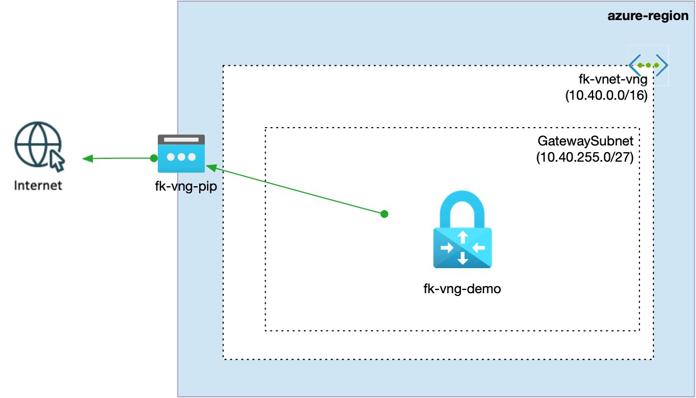

# Example 01: Basic Azure VNG

In this first example, we deploy a **minimal Azure Virtual Network Gateway (VNG)** stack using **Terraform/OpenTofu**.

Unlike the module root, this example does not build network primitives manually. Instead, it composes the already existing
FoggyKitchen building blocks:

- `terraform-az-fk-vnet` for the Virtual Network and `GatewaySubnet`
- `terraform-az-fk-public-ip` for the gateway Public IP
- `terraform-az-fk-vng` for the Virtual Network Gateway itself

This keeps the example aligned with the rest of the FoggyKitchen ecosystem and shows how the modules are meant to be used together.

---

## 🧭 Architecture Overview



This deployment creates:

- A new **Resource Group**
- A **Virtual Network** created by the `terraform-az-fk-vnet` module
- A single **GatewaySubnet** inside that VNet
- A **Public IP** created by the `terraform-az-fk-public-ip` module
- A **Virtual Network Gateway** created by the `terraform-az-fk-vng` module

The example is intentionally simple and focuses on the **minimum viable gateway architecture**.

---

## 🚀 Deployment Steps

Initialize and apply the Terraform/OpenTofu configuration:

```bash
tofu init
tofu plan
tofu apply
```

After a successful deployment, Terraform will output:

- The VNet ID
- The GatewaySubnet ID
- The Public IP ID
- The Virtual Network Gateway ID

---

## 🖼️ Azure Portal View

After deployment, you should see:

- One Virtual Network with a `GatewaySubnet`
- One Standard Static Public IP
- One Virtual Network Gateway attached to the subnet and public IP

This is the simplest practical layout for a VPN gateway-backed Azure network.

---

## 🧹 Cleanup

To remove all resources created by this example:

```bash
tofu destroy
```

---

## ✅ Summary

This example demonstrates:

- How to compose Azure networking from reusable FoggyKitchen modules
- How `terraform-az-fk-vnet` provides the subnet foundation
- How `terraform-az-fk-public-ip` supplies the gateway public IP
- How `terraform-az-fk-vng` binds those pieces into a working gateway

---

## 🌐 Learn More

Visit [FoggyKitchen.com](https://foggykitchen.com/) for Azure, multicloud, and Terraform/OpenTofu learning resources.

---

## 🪪 License

Licensed under the **Universal Permissive License (UPL), Version 1.0**.  
See [LICENSE](../../LICENSE) for more details.
